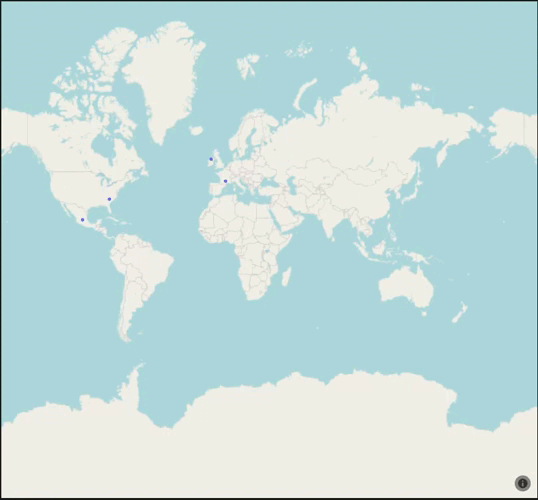
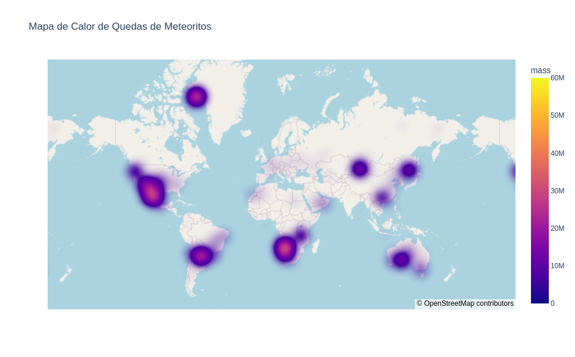
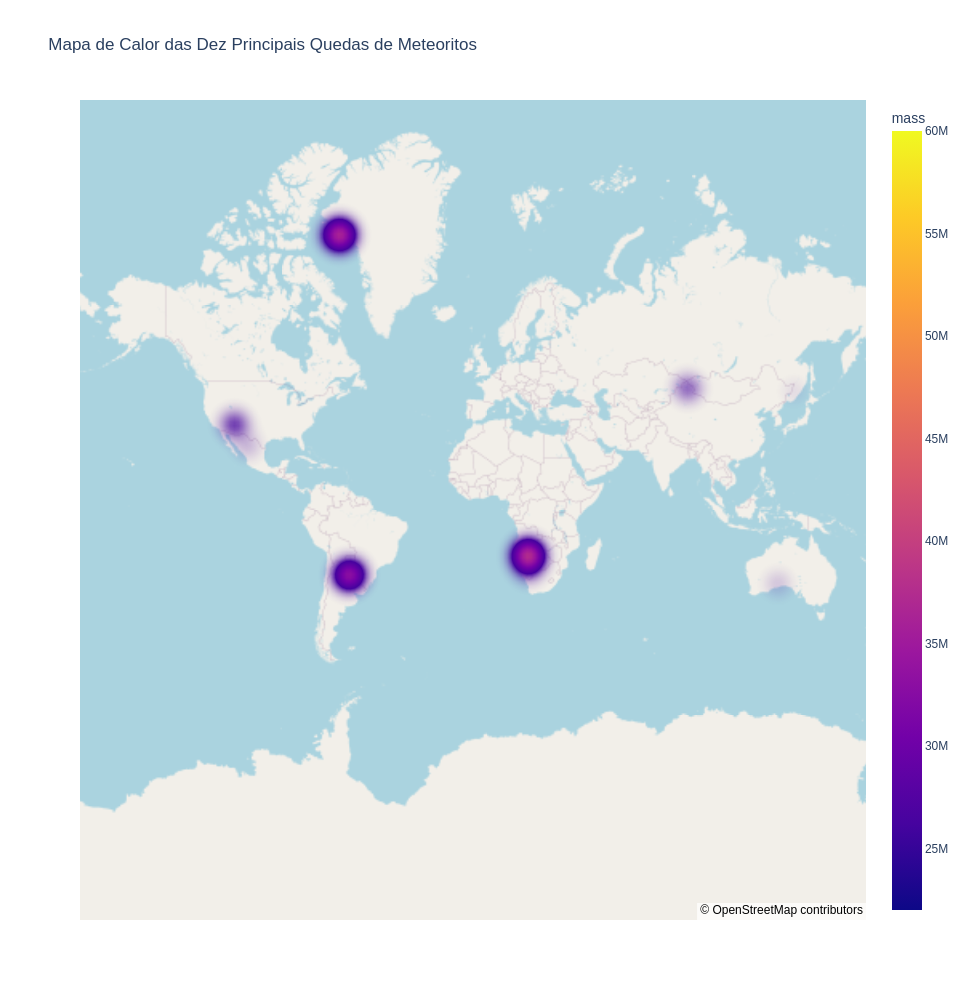

# Análise Meteoritos

## Ojetivo:

O objetivo do projeto é explorar e visualizar as quedas de meteoritos ocorridas no período de 860 a 2013. A abordagem incluirá a criação de mapas interativos e informativos, destacando a distribuição geográfica desses eventos ao longo dos anos. Será desenvolvido um mapa animado que permitirá observar as quedas de meteoritos de forma dinâmica, evidenciando as variações ao longo do tempo. Essa visualização animada proporcionará uma perspectiva única e cativante das ocorrências de meteoritos, destacando padrões temporais e geográficos ao longo do extenso período investigado. O objetivo final é proporcionar uma compreensão mais abrangente e envolvente das quedas de meteoritos ao longo dos séculos.

## Imagens e GIFs

### Animação das Quedas de Meteoritos ao Longo dos Anos

### Mapa de Calor de Quedas de Meteoritos

### Mapa de Calor das Dez Principais Quedas de Meteoritos

### Mapa HTML das Quedas de Meteoritos

## Como Visualizar o Codigo?
Basta clicar no arquivo "analise-meteoritos.ipynb" irá abrir uma versão web do notebook onde estão os codigos, os mapas não são visiveis na versão web.
